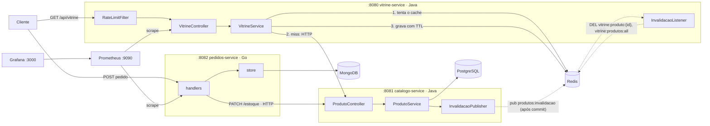

# 🧊 Cacheiro

<p align="center">
  
  
  
  
  
  
  
  
  
  
  
</p>

Projeto de estudo de **microsserviços com cache distribuído**. Uma **vitrine** (leitura) consulta um **catálogo** (fonte da verdade) e usa **Redis** como cache no padrão *cache-aside*, com **invalidação ativa via pub/sub**, **rate limiting** e **observabilidade completa** (Actuator → Prometheus → Grafana) para *ver* o ganho do cache na prática. Um terceiro serviço, **pedidos** (em **Go + MongoDB**), fecha o ciclo: cria pedidos, baixa o estoque no catálogo por HTTP e — de graça, sem tocar no Redis — dispara a invalidação de cache que já existe.

> [!NOTE]
> O objetivo é didático: cada peça existe para demonstrar um conceito (cache-aside, anti-stampede, invalidação por evento, rate limit distribuído, *database per service*, poliglota Java+Go). A latência do catálogo é **simulada** para o efeito do cache ficar visível.

## 🏗️ Arquitetura



### Fluxo de leitura — cache-aside (vitrine)

1. A vitrine recebe a requisição (passando pelo **rate limit** de 100 req/min por IP) e **tenta o Redis primeiro** (`vitrine:produto:{id}` ou `vitrine:produtos:all`).
2. **Hit** → devolve direto do cache (poucos ms ⚡).
3. **Miss** → chama o catálogo via HTTP, que consulta o PostgreSQL com **latência simulada de 300ms**. No detalhe de produto, um **lock anti-stampede** garante que só uma requisição concorrente vá à origem.
4. A resposta é gravada no Redis com **TTL** (45s para produto, 20s para a lista) e devolvida.

### Fluxo de escrita — invalidação ativa (catálogo)

1. `POST`/`PUT`/`DELETE`/`PATCH` no catálogo altera o PostgreSQL.
2. **Após o commit** da transação, o catálogo publica o `id` no canal Redis `produtos:invalidacao` (publicar antes do commit abriria uma corrida em que a vitrine re-cacheia o dado antigo).
3. A vitrine, inscrita no canal, deleta `vitrine:produto:{id}` e `vitrine:produtos:all` — a próxima leitura já reflete o dado novo, **sem esperar o TTL**.

### Fluxo de pedido — saga por compensação (pedidos)

1. `POST` no pedidos valida o produto no catálogo e chama `PATCH /api/produtos/{id}/estoque` com `delta` negativo — **o catálogo é o dono do estoque**, o pedidos nunca escreve na tabela `produtos`.
2. Se o estoque baixa com sucesso, grava o pedido no MongoDB. Se a gravação falha, **devolve o estoque** (`delta` positivo) — compensação, já que não há transação distribuída.
3. Como a baixa passou pelo catálogo, a **invalidação de cache acontece sozinha** — o pedidos nem sabe que o Redis existe.
4. Cancelar um pedido (`PATCH .../status` → `CANCELADO`) devolve o estoque pela mesma via.

## 🛠️ Stack

| Tecnologia | Uso |
|---|---|
| **Java 21 + Spring Boot 4** | vitrine e catálogo (Web MVC, Data JPA, Data Redis, Actuator) |
| **Go 1.26 (stdlib)** | pedidos-service — router `net/http`, sem framework |
| **PostgreSQL 16** | Fonte da verdade do catálogo |
| **MongoDB 7** | Banco próprio do pedidos (*database per service*) |
| **Redis 7** | Cache distribuído, pub/sub de invalidação e contador do rate limit |
| **Flyway** | Versionamento do schema do catálogo (cria e popula `produtos`) |
| **Micrometer + Prometheus** | Métricas raspadas a cada 15s (hit/miss do cache, JVM, HTTP, Go) |
| **Grafana 12** | Dashboards sobre o Prometheus (datasource e painel provisionados) |
| **Lombok** | Menos boilerplate no lado Java |
| **Docker Compose** | Orquestração local dos 8 containers com healthchecks |
| **GitHub Actions** | CI (testes dos 3 serviços) e CD (build + push das imagens no GHCR) |

## 🗃️ Modelagem

**PostgreSQL** — uma tabela, criada e populada pelo Flyway (`V1__criar_tabela_produtos.sql`) com 8 produtos de exemplo:

```
produtos
├── id         BIGSERIAL      PK
├── nome       VARCHAR(120)   NOT NULL
├── descricao  VARCHAR(500)
├── preco      NUMERIC(10,2)  NOT NULL
└── estoque    INTEGER        NOT NULL DEFAULT 0
```

**MongoDB** — coleção `pedidos.pedidos`, documento autocontido (sem join; dados do produto vêm por HTTP):

```
pedido
├── _id            ObjectId   (gerado pelo Mongo)
├── produtoId      int64
├── quantidade     int
├── precoUnitario  string     (nunca float para dinheiro)
├── status         CRIADO → PAGO → ENVIADO | CANCELADO
├── criadoEm       datetime (UTC)
└── atualizadoEm   datetime (UTC)
```

**Redis** — chaves em uso:

| Chave | Quem grava | TTL | Conteúdo |
|---|---|---|---|
| `vitrine:produto:{id}` | vitrine | 45s | JSON de um produto |
| `vitrine:produtos:all` | vitrine | 20s | JSON da listagem |
| `vitrine:lock:produto:{id}` | vitrine | 5s | Lock anti-stampede |
| `vitrine:ratelimit:{ip}` | vitrine | 60s | Contador de requisições do IP |
| `produtos:invalidacao` | catálogo (pub) | — | Canal pub/sub, sem prefixo: é contrato entre serviços |

As chaves de keyspace da vitrine vivem em `Keys.java` — o prefixo `vitrine:` evita colisão caso outro serviço compartilhe o mesmo Redis.

## 📡 Endpoints

**vitrine-service (`:8080`)** — leitura com cache:

| Método | Rota | Descrição |
|---|---|---|
| `GET` | `/api/vitrine` | Lista produtos (cache 20s) |
| `GET` | `/api/vitrine/{id}` | Detalha produto (cache 45s + lock anti-stampede) |
| `GET` | `/actuator/health` | Health check |
| `GET` | `/actuator/prometheus` | Métricas para o Prometheus |

**catalogo-service (`:8081`)** — CRUD, dono dos dados (toda escrita invalida o cache via pub/sub):

| Método | Rota | Descrição |
|---|---|---|
| `GET` | `/api/produtos` | Lista todos |
| `GET` | `/api/produtos/{id}` | Busca por id (404 se não existe) |
| `POST` | `/api/produtos` | Cria (201) |
| `PUT` | `/api/produtos/{id}` | Atualiza |
| `PATCH` | `/api/produtos/{id}/estoque` | Ajuste atômico de estoque por `delta` (204; 409 se insuficiente) |
| `DELETE` | `/api/produtos/{id}` | Remove (204) |

**pedidos-service (`:8082`, Go)** — cria pedidos e orquestra o estoque:

| Método | Rota | Descrição |
|---|---|---|
| `POST` | `/api/pedido` | Cria pedido: valida produto, baixa estoque, grava (201) |
| `GET` | `/api/pedido` | Lista pedidos |
| `GET` | `/api/pedido/{id}` | Busca pedido por id |
| `PATCH` | `/api/pedido/{id}/status` | Transição de status (204; `CANCELADO` devolve estoque) |
| `GET` | `/healthz` | Health check (ping no Mongo) |
| `GET` | `/metrics` | Métricas para o Prometheus |

## 🚀 Como rodar

Pré-requisito: Docker + Docker Compose.

**1.** Crie um arquivo `.env` na raiz:

```env
POSTGRES_DB=catalogo
POSTGRES_USER=postgres
POSTGRES_PASSWORD=postgres
SPRING_DATASOURCE_URL=jdbc:postgresql://postgres:5432/catalogo
SPRING_DATASOURCE_USERNAME=postgres
SPRING_DATASOURCE_PASSWORD=postgres
SPRING_DATA_REDIS_HOST=redis
CATALOGO_URL=http://catalogo-service:8081
MONGO_URL=mongodb://mongodb:27017
```

**2.** Suba tudo:

**Opção A — imagens prontas (rápido):** puxa as imagens já compiladas do GHCR, sem compilar nada localmente (não precisa ter Java 21 ou Go 1.26 instalados).

```bash
docker compose up
```

**Opção B — build local (desenvolvimento):** compila do código-fonte a partir dos Dockerfiles.

```bash
docker compose up --build
```

O Flyway cria a tabela e insere os 8 produtos de exemplo. Ficam de pé:

| URL | O quê |
|---|---|
| http://localhost:8080/api/vitrine | Vitrine (API com cache) |
| http://localhost:8081/api/produtos | Catálogo (CRUD) |
| http://localhost:8082/api/pedido | Pedidos (Go) |
| http://localhost:9090 | Prometheus |
| http://localhost:3000 | Grafana (`admin` / `admin`) |

**3.** Veja o cache em ação:

```bash
# 1ª chamada: miss (~300ms, passa pelo catálogo)
time curl -s localhost:8080/api/vitrine/1 > /dev/null

# 2ª chamada: hit (poucos ms, direto do Redis)
time curl -s localhost:8080/api/vitrine/1 > /dev/null

# Atualize o produto e veja a invalidação imediata (sem esperar TTL)
curl -X PUT localhost:8081/api/produtos/1 \
  -H "Content-Type: application/json" \
  -d '{"nome":"Teclado mecânico","descricao":"Switch brown, ABNT2","preco":199.90,"estoque":15}'
curl localhost:8080/api/vitrine/1
```

**4.** Crie um pedido e veja o estoque cair + o cache invalidar sozinho:

```bash
# baixa 2 unidades do produto 1 via pedido-service
curl -X POST localhost:8082/api/pedido \
  -H "Content-Type: application/json" \
  -d '{"produtoId":1,"quantidade":2}'

# a vitrine já reflete o novo estoque, sem esperar TTL
curl localhost:8080/api/vitrine/1
```

## 📊 Observabilidade

O Prometheus raspa `vitrine-service:8080/actuator/prometheus` e `pedidos-service:8082/metrics` a cada 15s (config em [`observability/prometheus.yml`](observability/prometheus.yml)); o Grafana sobe com o datasource **e o dashboard** já provisionados.

Depois do `docker compose up`, o painel está pronto em **[localhost:3000](http://localhost:3000)** (`admin`/`admin`) → dashboard **Cacheiro — Vitrine**, sem nenhum clique de configuração:

| Painel | O que mostra |
|---|---|
| Cache hit ratio | Fração servida pelo Redis; cai a cada expiração de TTL ou invalidação |
| Latência p95 por rota | O contraste hit (poucos ms) vs. miss (~300ms do catálogo) |
| Throughput por rota | Requisições/s por rota e status |
| Rate limit — 429/s | Requisições barradas pelo filtro de 100 req/min por IP |

Gere tráfego para os painéis saírem do zero:

```bash
for i in $(seq 200); do curl -s localhost:8080/api/vitrine/1 > /dev/null; done
# passa dos 100 req/min e acende o painel de 429 também
```

A métrica principal é o contador `vitrine_cache_total`, incrementado pela aplicação a cada leitura:

```promql
# Hit ratio do cache nos últimos 5 minutos
sum(rate(vitrine_cache_total{result="hit"}[5m]))
/
sum(rate(vitrine_cache_total[5m]))
```

Outras queries úteis: `rate(http_server_requests_seconds_count[1m])` (throughput por rota) e `histogram_quantile(0.95, sum by (le, uri) (rate(http_server_requests_seconds_bucket[1m])))` (p95 — compare a vitrine com hit vs. miss). Os buckets do p95 dependem de `management.metrics.distribution.percentiles-histogram` ligado no `application.yaml`; sem isso o Micrometer publica só count/sum/max e o `histogram_quantile` não retorna nada.

## ⚙️ Configurações relevantes

| Propriedade | Serviço | Padrão | O que faz |
|---|---|---|---|
| `vitrine.cache.ttl-produto` | vitrine | `45s` | TTL do cache de produto individual |
| `vitrine.cache.ttl-lista` | vitrine | `20s` | TTL do cache da listagem |
| `catalogo.latencia-simulada-ms` | catálogo | `300` | Latência artificial para simular banco lento |
| `LIMITE_POR_MINUTO` (constante) | vitrine | `100` | Rate limit por IP por minuto |
| `MONGO_URL` | pedidos | `mongodb://localhost:27017` | Conexão do MongoDB |
| `CATALOGO_URL` | pedidos / vitrine | — | Base HTTP do catálogo |

## 📂 Estrutura

```
cacheiro/
├── docker-compose.yaml          # redis, postgres, mongodb, catálogo, vitrine, pedidos, prometheus, grafana
├── observability/
│   ├── prometheus.yml           # scrape da vitrine e do pedidos a cada 15s
│   ├── grafana-datasource.yml   # datasource Prometheus provisionado
│   └── grafana-dashboard*.{yml,json}  # dashboard Cacheiro provisionado
├── catalogo-service/            # Java · CRUD + PostgreSQL + Flyway + pub de invalidação
│   └── src/main/java/com/dev/cacheiro/catalogo/
│       ├── controller/  ├── service/  ├── repository/
│       ├── entity/      ├── dtos/     └── eventos/
├── vitrine-service/             # Java · leitura + cache Redis + rate limit + métricas
│   └── src/main/java/com/dev/cacheiro/vitrine/
│       ├── produto/             # controller, service, client HTTP
│       ├── cache/               # listener de invalidação, config, props e Keys
│       └── ratelimit/           # filtro de rate limit por IP
└── pedido-service/              # Go · pedidos + MongoDB + compensação de estoque
    ├── main.go                  # App, router net/http, wiring
    ├── handlers.go              # criar/listar/buscar pedido, transição de status
    ├── catalogo.go              # client HTTP do catálogo (buscar, ajustar estoque)
    └── store.go                 # struct Pedido + acesso ao MongoDB
```

## 💡 Conceitos demonstrados

- **Cache-aside** (lazy loading): a aplicação gerencia o cache manualmente — lê, e se não achar, busca na origem e grava com TTL.
- **Invalidação ativa via pub/sub**: escrita no catálogo publica evento no Redis **após o commit** e a vitrine derruba as chaves na hora — TTL vira apenas a rede de segurança.
- **Anti-stampede (dogpile) lock**: `SET NX` com expiração garante que, num miss concorrido, só uma requisição vá à origem.
- **Rate limiting distribuído**: `INCR` + `EXPIRE` no Redis limitam requisições por IP, funcionando mesmo com múltiplas instâncias da vitrine.
- **Database per service**: catálogo (PostgreSQL) e pedidos (MongoDB) têm bancos próprios; um não enxerga o do outro.
- **Saga por compensação**: sem transação distribuída, o pedidos baixa o estoque via HTTP e o devolve se a gravação (ou o cancelamento) exigir.
- **Separação leitura/escrita**: a vitrine só lê; escrita acontece no catálogo, dono dos dados.
- **Poliglota**: dois serviços em Spring Boot e um em Go stdlib, provando o contrato HTTP/pub-sub independe de linguagem.
- **Observabilidade**: contador de hit/miss via Micrometer, exposto no Actuator, raspado pelo Prometheus e visualizado no Grafana.
- **CI/CD com GitHub Actions**: cada push roda os testes de integração dos três serviços (com Postgres, Redis e Mongo efêmeros no runner); o merge na `main` builda e publica as três imagens Docker no GHCR automaticamente.
