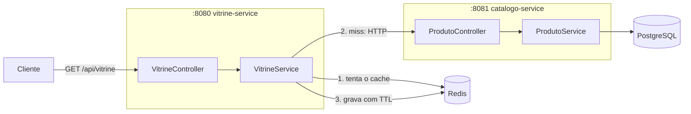

# 🧊 Cacheiro

Projeto de estudo de **microsserviços com cache distribuído**: dois serviços Spring Boot, onde a **vitrine** consulta o **catálogo** e usa **Redis** como cache (padrão *cache-aside*) para reduzir a latência, com métricas de hit/miss para visualizar o ganho na prática.

## 🏗️ Arquitetura



### Fluxo de uma requisição (cache-aside)

1. A vitrine recebe a requisição e **tenta o Redis primeiro** (`produto:{id}` ou `produtos:all`).
2. **Hit** → devolve direto do cache (rápido ⚡).
3. **Miss** → chama o catálogo via HTTP, que consulta o PostgreSQL com uma **latência simulada de 300ms** (para o efeito do cache ficar visível).
4. A resposta é gravada no Redis com **TTL** (45s para produto, 20s para a lista) e devolvida ao cliente.

## 🛠️ Tecnologias

| Tecnologia | Uso |
|---|---|
| **Java 21** | Linguagem |
| **Spring Boot 4** | Framework dos dois serviços (Web MVC, Data JPA, Data Redis, Validation, Actuator) |
| **PostgreSQL 16** | Fonte da verdade do catálogo |
| **Redis 7** | Cache distribuído + contadores de métricas |
| **Flyway** | Versionamento do schema do banco (migration cria e popula a tabela `produtos`) |
| **Lombok** | Menos boilerplate |
| **Docker Compose** | Orquestração local dos 4 containers com healthchecks |

## 📦 Serviços

### `catalogo-service` (porta 8081)

CRUD de produtos, dono dos dados. Simula latência de banco (300ms) para evidenciar o valor do cache.

| Método | Rota | Descrição |
|---|---|---|
| `GET` | `/api/produtos` | Lista todos os produtos |
| `GET` | `/api/produtos/{id}` | Busca produto por id |
| `POST` | `/api/produtos` | Cria produto |
| `PUT` | `/api/produtos/{id}` | Atualiza produto |
| `DELETE` | `/api/produtos/{id}` | Remove produto |

### `vitrine-service` (porta 8080)

Camada de leitura voltada ao cliente, com cache Redis na frente do catálogo.

| Método | Rota | Descrição |
|---|---|---|
| `GET` | `/api/vitrine` | Lista produtos (cache com TTL de 20s) |
| `GET` | `/api/vitrine/{id}` | Detalha produto (cache com TTL de 45s) |
| `GET` | `/metrics/cache` | Hits, misses e hit ratio do cache |

## 🚀 Como rodar

Pré-requisito: Docker + Docker Compose.

1. Crie um arquivo `.env` na raiz:

```env
POSTGRES_DB=catalogo
POSTGRES_USER=postgres
POSTGRES_PASSWORD=postgres
SPRING_DATASOURCE_URL=jdbc:postgresql://postgres:5432/catalogo
SPRING_DATASOURCE_USERNAME=postgres
SPRING_DATASOURCE_PASSWORD=postgres
SPRING_DATA_REDIS_HOST=redis
CATALOGO_URL=http://catalogo-service:8081
```

2. Suba tudo:

```bash
docker compose up --build
```

O Flyway cria a tabela e já insere 8 produtos de exemplo (teclado, mouse, monitor...).

### Vendo o cache em ação

```bash
# 1ª chamada: miss (~300ms, passa pelo catálogo)
curl localhost:8080/api/vitrine/1

# 2ª chamada: hit (poucos ms, direto do Redis)
curl localhost:8080/api/vitrine/1

# Métricas
curl localhost:8080/metrics/cache
# {"hits":1,"misses":1,"hitRatio":"50.0%"}
```

## ⚙️ Configurações relevantes

| Propriedade | Serviço | Padrão | O que faz |
|---|---|---|---|
| `vitrine.cache.ttl-produto` | vitrine | `45s` | TTL do cache de produto individual |
| `vitrine.cache.ttl-lista` | vitrine | `20s` | TTL do cache da listagem |
| `catalogo.latencia-simulada-ms` | catálogo | `300` | Latência artificial para simular banco lento |

## 📂 Estrutura

```
cacheiro/
├── docker-compose.yaml
├── catalogo-service/        # CRUD + PostgreSQL + Flyway
│   └── src/main/java/com/dev/cacheiro/catalogo/
│       ├── controller/  ├── service/  ├── repository/
│       ├── entity/      └── dtos/
└── vitrine-service/         # Leitura + cache Redis + métricas
    └── src/main/java/com/dev/cacheiro/vitrine/
        ├── produto/         # controller, service, client HTTP
        └── cache/           # métricas e propriedades do cache
```

## 💡 Conceitos demonstrados

- **Cache-aside** (lazy loading): a aplicação gerencia o cache manualmente — lê, e se não achar, busca na origem e grava.
- **TTL** como estratégia simples de invalidação: dados expiram sozinhos, sem precisar de invalidação ativa no CRUD.
- **Separação leitura/escrita**: a vitrine só lê; escrita acontece no catálogo, dono dos dados.
- **Observabilidade do cache**: contadores de hit/miss no próprio Redis, expostos em `/metrics/cache`.
