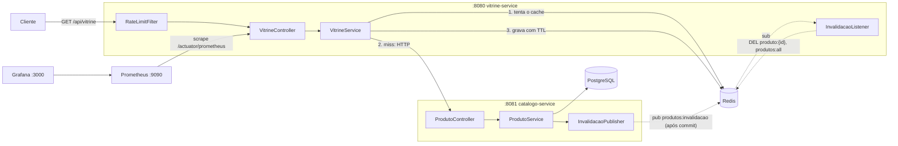

# 🧊 Cacheiro

Projeto de estudo de **microsserviços com cache distribuído**: dois serviços Spring Boot, onde a **vitrine** consulta o **catálogo** e usa **Redis** como cache (padrão *cache-aside*), com **invalidação ativa via pub/sub**, **rate limiting** e **observabilidade completa** (Actuator → Prometheus → Grafana) para visualizar o ganho do cache na prática.

## 🏗️ Arquitetura



### Fluxo de leitura (cache-aside)

1. A vitrine recebe a requisição (passando pelo **rate limit** de 100 req/min por IP) e **tenta o Redis primeiro** (`produto:{id}` ou `produtos:all`).
2. **Hit** → devolve direto do cache (poucos ms ⚡).
3. **Miss** → chama o catálogo via HTTP, que consulta o PostgreSQL com **latência simulada de 300ms** (para o efeito do cache ficar visível). No detalhe de produto, um **lock anti-stampede** garante que só uma requisição concorrente vá à origem.
4. A resposta é gravada no Redis com **TTL** (45s para produto, 20s para a lista) e devolvida.

### Fluxo de escrita (invalidação ativa)

1. `POST`/`PUT`/`DELETE` no catálogo altera o PostgreSQL.
2. **Após o commit** da transação, o catálogo publica o `id` no canal Redis `produtos:invalidacao` (publicar antes do commit abriria uma corrida em que a vitrine re-cacheia o dado antigo).
3. A vitrine, inscrita no canal, deleta `produto:{id}` e `produtos:all` — a próxima leitura já reflete o dado novo, **sem esperar o TTL**.

## 🛠️ Stack

| Tecnologia | Uso |
|---|---|
| **Java 21** | Linguagem |
| **Spring Boot 4** | Framework dos dois serviços (Web MVC, Data JPA, Data Redis, Actuator) |
| **PostgreSQL 16** | Fonte da verdade do catálogo |
| **Redis 7** | Cache distribuído, pub/sub de invalidação e contador do rate limit |
| **Flyway** | Versionamento do schema (migration cria e popula a tabela `produtos`) |
| **Micrometer + Prometheus** | Métricas da aplicação (hit/miss do cache, JVM, HTTP) raspadas a cada 15s |
| **Grafana 12** | Dashboards sobre o Prometheus (datasource provisionado automaticamente) |
| **Lombok** | Menos boilerplate |
| **Docker Compose** | Orquestração local dos 6 containers com healthchecks |

## 🗃️ Modelagem

Uma única tabela, criada e populada pelo Flyway (`V1__criar_tabela_produtos.sql`) com 8 produtos de exemplo:

```
produtos
├── id         BIGSERIAL      PK
├── nome       VARCHAR(120)   NOT NULL
├── descricao  VARCHAR(500)
├── preco      NUMERIC(10,2)  NOT NULL
└── estoque    INTEGER        NOT NULL DEFAULT 0
```

No Redis, as chaves em uso:

| Chave | Quem grava | TTL | Conteúdo |
|---|---|---|---|
| `produto:{id}` | vitrine | 45s | JSON de um produto |
| `produtos:all` | vitrine | 20s | JSON da listagem |
| `lock:produto:{id}` | vitrine | 5s | Lock anti-stampede |
| `ratelimit:{ip}` | vitrine | 60s | Contador de requisições do IP |

## 📡 Endpoints

Resumo abaixo — exemplos completos de request/response e a receita de teste estão em **[ENDPOINTS.md](ENDPOINTS.md)**.

**vitrine-service (`:8080`)** — leitura com cache:

| Método | Rota | Descrição |
|---|---|---|
| `GET` | `/api/vitrine` | Lista produtos (cache 20s) |
| `GET` | `/api/vitrine/{id}` | Detalha produto (cache 45s + lock anti-stampede) |
| `GET` | `/actuator/health` | Health check |
| `GET` | `/actuator/prometheus` | Métricas para o Prometheus |

**catalogo-service (`:8081`)** — CRUD, dono dos dados (toda escrita invalida o cache via pub/sub):

| Método | Rota | Descrição |
|---|---|---|
| `GET` | `/api/produtos` | Lista todos |
| `GET` | `/api/produtos/{id}` | Busca por id (404 se não existe) |
| `POST` | `/api/produtos` | Cria (201) |
| `PUT` | `/api/produtos/{id}` | Atualiza |
| `DELETE` | `/api/produtos/{id}` | Remove (204) |

## 🚀 Como rodar

Pré-requisito: Docker + Docker Compose.

**1.** Crie um arquivo `.env` na raiz:

```env
POSTGRES_DB=catalogo
POSTGRES_USER=postgres
POSTGRES_PASSWORD=postgres
SPRING_DATASOURCE_URL=jdbc:postgresql://postgres:5432/catalogo
SPRING_DATASOURCE_USERNAME=postgres
SPRING_DATASOURCE_PASSWORD=postgres
SPRING_DATA_REDIS_HOST=redis
CATALOGO_URL=http://catalogo-service:8081
```

**2.** Suba tudo:

```bash
docker compose up --build
```

O Flyway cria a tabela e insere os 8 produtos de exemplo. Ficam de pé:

| URL | O quê |
|---|---|
| http://localhost:8080/api/vitrine | Vitrine (API com cache) |
| http://localhost:8081/api/produtos | Catálogo (CRUD) |
| http://localhost:9090 | Prometheus |
| http://localhost:3000 | Grafana (`admin` / `admin`) |

**3.** Veja o cache em ação:

```bash
# 1ª chamada: miss (~300ms, passa pelo catálogo)
time curl -s localhost:8080/api/vitrine/1 > /dev/null

# 2ª chamada: hit (poucos ms, direto do Redis)
time curl -s localhost:8080/api/vitrine/1 > /dev/null

# Atualize o produto e veja a invalidação imediata (sem esperar TTL)
curl -X PUT localhost:8081/api/produtos/1 \
  -H "Content-Type: application/json" \
  -d '{"nome":"Teclado mecânico","descricao":"Switch brown, ABNT2","preco":199.90,"estoque":15}'
curl localhost:8080/api/vitrine/1
```

## 📊 Observabilidade

O Prometheus raspa `vitrine-service:8080/actuator/prometheus` a cada 15s (config em [`observability/prometheus.yml`](observability/prometheus.yml)); o Grafana sobe com o datasource já provisionado ([`observability/grafana-datasource.yml`](observability/grafana-datasource.yml)).

A métrica principal é o contador `vitrine_cache_total`, incrementado pela aplicação a cada leitura:

```promql
# Hit ratio do cache nos últimos 5 minutos
sum(rate(vitrine_cache_total{result="hit"}[5m]))
/
sum(rate(vitrine_cache_total[5m]))
```

Outras queries úteis: `rate(http_server_requests_seconds_count[1m])` (throughput por rota) e `http_server_requests_seconds` (latência — compare a vitrine com hit vs. miss).

## ⚙️ Configurações relevantes

| Propriedade | Serviço | Padrão | O que faz |
|---|---|---|---|
| `vitrine.cache.ttl-produto` | vitrine | `45s` | TTL do cache de produto individual |
| `vitrine.cache.ttl-lista` | vitrine | `20s` | TTL do cache da listagem |
| `catalogo.latencia-simulada-ms` | catálogo | `300` | Latência artificial para simular banco lento |
| `LIMITE_POR_MINUTO` (constante) | vitrine | `100` | Rate limit por IP por minuto |

## 📂 Estrutura

```
cacheiro/
├── docker-compose.yaml          # redis, postgres, catálogo, vitrine, prometheus, grafana
├── ENDPOINTS.md                 # referência completa das APIs
├── observability/
│   ├── prometheus.yml           # scrape da vitrine a cada 15s
│   └── grafana-datasource.yml   # datasource Prometheus provisionado
├── catalogo-service/            # CRUD + PostgreSQL + Flyway + pub de invalidação
│   └── src/main/java/com/dev/cacheiro/catalogo/
│       ├── controller/  ├── service/  ├── repository/
│       ├── entity/      ├── dtos/     └── eventos/
└── vitrine-service/             # leitura + cache Redis + rate limit + métricas
    └── src/main/java/com/dev/cacheiro/vitrine/
        ├── produto/             # controller, service, client HTTP
        ├── cache/               # listener de invalidação, config e props do cache
        └── ratelimit/           # filtro de rate limit por IP
```

## 💡 Conceitos demonstrados

- **Cache-aside** (lazy loading): a aplicação gerencia o cache manualmente — lê, e se não achar, busca na origem e grava com TTL.
- **Invalidação ativa via pub/sub**: escrita no catálogo publica evento no Redis **após o commit** e a vitrine derruba as chaves na hora — TTL vira apenas a rede de segurança.
- **Anti-stampede (dogpile) lock**: `SET NX` com expiração garante que, num miss concorrido, só uma requisição vá à origem.
- **Rate limiting distribuído**: `INCR` + `EXPIRE` no Redis limitam requisições por IP, funcionando mesmo com múltiplas instâncias da vitrine.
- **Separação leitura/escrita**: a vitrine só lê; escrita acontece no catálogo, dono dos dados.
- **Observabilidade**: contador de hit/miss via Micrometer, exposto no Actuator, raspado pelo Prometheus e visualizado no Grafana.
