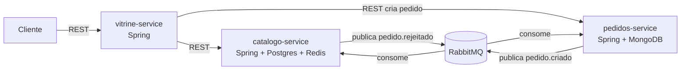
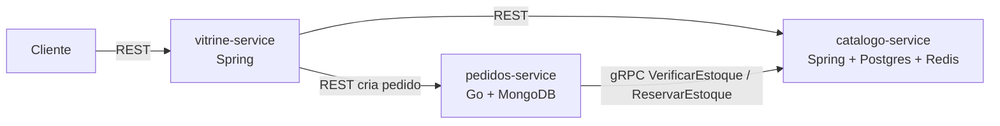

# Ideias para um terceiro microsserviço

Contexto atual: `vitrine-service` (mostra produtos, chama catálogo via REST) +
`catalogo-service` (dono dos dados, Postgres + Redis). Cache já está coberto.
Ideia: um terceiro serviço que resolve algo que REST síncrono resolve mal —
processamento assíncrono, desacoplado, com fila.

## Opção 1 — `pedidos-service` (recomendada)

Cliente fecha um pedido na vitrine → `pedidos-service` grava o pedido e
publica um evento no RabbitMQ. Ninguém mais fica esperando resposta síncrona.

- **Exchange:** `pedidos.exchange` (topic)
- **Routing key:** `pedido.criado`
- **Consumidores:**
  - `catalogo-service` escuta `pedido.criado` → dá baixa no estoque do produto.
    Se estoque insuficiente, publica `pedido.rejeitado` de volta.
  - `pedidos-service` escuta `pedido.rejeitado` → atualiza status do pedido pra `CANCELADO`.

- **Entidade `Pedido`:** id, produtoId, quantidade, status (`PENDENTE`,
  `CONFIRMADO`, `CANCELADO`), criadoEm.
- **Endpoints REST:** `POST /pedidos`, `GET /pedidos/{id}` (consulta status —
  aqui dá até pra mostrar um segundo uso de cache: status do pedido em Redis
  com TTL curto, pra não bater no banco toda hora que o cliente atualiza a
  página esperando confirmação).
- **Banco: MongoDB (NoSQL), não Postgres.** Além de dar polyglot persistence
  de graça (catálogo já é relacional), pedido combina bem com documento:
  `{ _id, produtoId, quantidade, status, historico: [...] }` guarda o
  histórico de status (PENDENTE → CONFIRMADO/CANCELADO) embutido, sem tabela
  de auditoria separada nem join. Spring Data MongoDB substitui o
  `ProdutoRepository` (JPA) por um `MongoRepository` equivalente — mesma
  camada, driver diferente.

**Por que fica legal:** mostra saga simples (criar → confirmar/rejeitar) sem
precisar de orquestrador, e o estoque assíncrono é um problema real (dois
pedidos simultâneos no mesmo produto) que dá pra discutir em apresentação.

## Opção 2 — `notificacao-service`

Escuta eventos que já existirem (`pedido.criado`, `pedido.confirmado`) e só
loga/simula envio de e-mail. Mais simples que a opção 1, mas sozinho é meio
raso — fica melhor como *complemento* da opção 1, não como o terceiro serviço
principal.

## Opção 3 — `estoque-service` separado do catálogo

Mesma ideia da opção 1, mas separando estoque do catálogo em vez de o próprio
catalogo-service consumir a fila. Mostra melhor "bounded context", mas é
serviço a mais, um banco a mais, e replica dado de produto (id, nome) só pra
saber o que tem estoque. Mais fiel a microsserviço "de livro", mais peso pra
manter.

## Opção 4 — `pedidos-service` em Go, falando gRPC com o catálogo

Mesma função da opção 1 (registrar pedido, baixar estoque), mas trocando a
stack e o protocolo em vez da mensageria. Serve pra estudar Go dentro de um
projeto que já existe, sem precisar inventar um projeto Go do zero.

- `vitrine-service` (Spring) → `pedidos-service` (Go) via REST/JSON, criando
  o pedido.
- `pedidos-service` (Go) → `catalogo-service` (Spring) via **gRPC**: contrato
  `estoque.proto` com `VerificarEstoque` e `ReservarEstoque`. O catálogo
  expõe isso com `grpc-spring-boot-starter`; o Go usa `google.golang.org/grpc`
  gerado a partir do mesmo `.proto`.
- **Banco: MongoDB**, igual à opção 1 — driver oficial `mongo-go-driver`.
  Mesmo motivo: pedido é documento (histórico de status embutido), e chega
  de graça o polyglot persistence (Postgres no catálogo, Mongo no pedidos).

**Por que fica legal:** dá pra comparar na prática REST (vitrine↔catálogo,
já existe) vs gRPC (pedidos↔catálogo, novo) no mesmo projeto, e ainda mostra
Go chamando Java e sendo chamado por Java — sem depender de RabbitMQ.

## Opção 1 vs Opção 4

Ambas usam MongoDB como segundo banco pro `pedidos-service`; a diferença é
só a comunicação (fila assíncrona vs gRPC síncrono) e a linguagem (Java vs
Go). Dá pra decidir isso por último — o contrato de dados (`Pedido`,
`VerificarEstoque`) é parecido nos dois casos.

## Diagramas

**Opção 1 — RabbitMQ (Java/Spring):**



**Opção 4 — Go + gRPC:**



## Recomendação

Ainda em aberto entre opção 1 (RabbitMQ) e opção 4 (Go + gRPC) — decide no
final do projeto qual encaixa melhor no tempo que sobrar. As duas mantêm o
MongoDB como segundo banco do `pedidos-service`, então essa parte não muda
independente da escolha. Opção 2 vira um `+1 hora de trabalho` se sobrar
tempo; opção 3 só se o trabalho pedir explicitamente separação de domínio.

## Infra extra no docker-compose

```yaml
rabbitmq:
  image: rabbitmq:3-management-alpine
  ports:
    - "5672:5672"
    - "15672:15672"  # painel web, útil pra demonstrar ao vivo
  healthcheck:
    test: ["CMD", "rabbitmqctl", "status"]
    interval: 5s
    timeout: 3s
    retries: 5

mongo:
  image: mongo:7
  ports:
    - "27017:27017"
  healthcheck:
    test: ["CMD", "mongosh", "--eval", "db.adminCommand('ping')"]
    interval: 5s
    timeout: 3s
    retries: 5
```

→ pulado: orquestração de saga (Camunda/Temporal), retry/DLQ avançado,
serviço de notificação real. Adiciona se o trabalho pedir tolerância a falha
como tema, não só "usar RabbitMQ".
